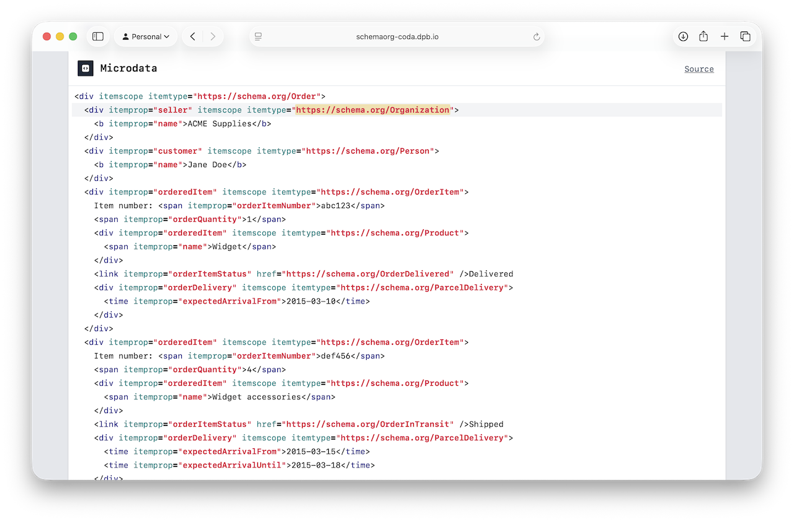

# inspecthtml-go

Parse HTML and capture metadata about byte offsets.

* Reference byte and line+column offsets of nodes and element attributes.
* Wraps the standard [`golang.org/x/net/html`](https://pkg.go.dev/golang.org/x/net/html) implementation.

## Usage

Import the module and refer to the code's documentation ([pkg.go.dev](https://pkg.go.dev/github.com/dpb587/inspecthtml-go/inspecthtml)).

```go
import "github.com/dpb587/inspecthtml-go/inspecthtml"
```

Some sample use cases and starter snippets can be found in the [`examples` directory](examples).

<details><summary><code>examples$ go run ./<strong>parse-dump</strong> <( echo '<strong>&lt;p class="headline"&gt;&lt;strong&gt;hello&lt;/strong&gt;&lt;br data-example /&gt;world&lt;!-- end--&gt;</strong>' )</code></summary>

> ```
>   <html>
>     <head>
>     </head>
>     <body>
>       // StartTagToken=L1C1:L1C21;0x0:0x14 OuterOffsets=L1C1:L2C1;0x0:0x4e InnerOffsets=L1C21:L2C1;0x14:0x4e
>       <p
>         // Attr KeyOffsets=L1C4:L1C9;0x3:0x8 ValueOffsets=L1C10:L1C20;0x9:0x13
>         class="headline"
>       >
>         // StartTagToken=L1C21:L1C29;0x14:0x1c OuterOffsets=L1C21:L1C43;0x14:0x2a InnerOffsets=L1C29:L1C34;0x1c:0x21
>         <strong>
>           // TextToken=L1C29:L1C34;0x1c:0x21
>           hello
>         // EndTagToken=L1C34:L1C43;0x21:0x2a
>         </strong>
>         // StartTagToken=L1C43:L1C62;0x2a:0x3d OuterOffsets=L1C43:L1C62;0x2a:0x3d SelfClosing
>         <br
>           // Attr KeyOffsets=L1C47:L1C59;0x2e:0x3a
>           data-example=""
>         >
>         </br>
>         // TextToken=L1C62:L1C67;0x3d:0x42
>         world
>         // CommentToken=L1C67:L1C78;0x42:0x4d
>         <!-- end-->
>         // TextToken=L1C78:L2C1;0x4d:0x4e
>         
> 
>       // EndTagToken=L2C1:L2C1;0x4e:0x4e
>       </p>
>     </body>
>   </html>
> ```

</details>

<details><summary><a href="https://github.com/dpb587/rdfkit-go"><strong>github.com/dpb587/rdfkit-go</strong></a> (importer example)</summary>

> Uses this module when extracting RDF data to support provenance and linter tool references to the original HTML nodes and attributes.
>
> Excerpt from [`encoding/html/htmldefaults/htmldefaultsrdfio/decoder.go`](https://github.com/dpb587/rdfkit-go/blob/4f872d0e21dbb67f89691581c944275fdbc768c8/encoding/html/htmldefaults/htmldefaultsrdfio/decoder.go#L41-L47)...
>
> ```go
>     options := htmldefaults.DecoderConfig{}.
>         SetDocumentLoaderJSONLD(e.jsonldDocumentLoader).
>         SetLocation(string(opts.BaseIRI))
> 
> 
>     if params.CaptureTextOffsets != nil {
>         options = options.SetCaptureTextOffsets(*params.CaptureTextOffsets)
>     }
> ```

</details>

<details><summary><a href="https://schemaorg-coda.dpb.io/example?name=eg-0376&term=Organization&ref=release%2Fv29.4#MICRODATA"><strong>schemaorg-coda.dpb.io</strong></a> (usage example)</summary>

> Uses this module to support injection of context-specific documentation links for attribute values without affecting the original HTML formatting.
>
> [](https://schemaorg-coda.dpb.io/example?name=eg-0376&term=Organization&ref=release%2Fv29.4#MICRODATA)

</details>

## Parser

Given an `io.Reader`, parse and return a standard `*html.Node` as well as the resulting metadata.

```go
parsedNode, parsedMetadata, err := inspecthtml.Parse(os.Stdin)
```

For any node of interest, retrieve it from the metadata provider.

```go
nodeMetadata, hasNodeMetadata := parsedMetadata.GetNodeMetadata(node)
```

The `nodeMetadata` value ([`NodeMetadata` type](https://pkg.go.dev/github.com/dpb587/inspecthtml-go/inspecthtml#NodeMetadata)) contains token, tag name, attributes (names, values), and end tag token offsets. Always check that specific offsets are available (non-`nil`) before accessing them. Specifically, keep in mind the following:

* The DOM Processor may inject elements to create a compliant HTML5 DOM tree. Injected elements will not have any metadata since they were not present in source.
* The DOM Processor may move and re-parent nodes to create a compliant HTML5 DOM tree. Re-parented nodes may be siblings in the DOM, but have non-sequential source offsets.
* The DOM Processor will close unclosed elements. In this case, the metadata will use a logical end tag of zero length based on the relative position of the next element or EOF.
* Element attributes may not have an offset for their value if there was no value in the source.
* Although unlikely, this implementation may not correctly detect the offsets of a malformed attribute and its value will be `nil`. This would be considered a bug, and an [issue](https://github.com/dpb587/inspecthtml-go/issues) with an example snippet to reproduce it would be appreciated.
* A document parsed by both `html.Parse` and `inspecthtml.Parse` may result in slightly different DOM trees due to accurately maintaining source offset references. However, the rendered output via `html.Render` is expected to be byte-equivalent (aside from the following, known exceptions).
  * All `style` elements are treated as raw text (vs `html` which parses the `style` data of foreign elements, namely SVG and MathML, and may produce additional text or comment nodes). Currently, this does not try to recursively parse `style` nodes which means nested nodes (e.g. `<!-- comments -->`) become HTML-escaped in its rendered output.

## Notes

This is implemented by pre-tokenizing the input stream to inject offset metadata before forwarding it to `html.Parse` and then cleaning up injected metadata from the resulting tree to closely match a traditional parse.

This approach is a bit hacky and inefficient due to double tokenization steps and additional, injected placeholder tokens that must be processed. There are a couple spots where Go's tokenization/parser implementation behaviors leak into this for the sake of accurate offsets tracking. This approach seemed like a reasonable alternative to the following (all of which become less compatible for existing `*html.Node`-based packages, too):

 * maintain an `html` fork with patched offset tracking features (seemed like an indefinite maintenance task);
 * reimplement the HTML5 specification with native offset tracking (seemed very complex and additional responsibility).

The [`go#34302` issue](https://github.com/golang/go/issues/34302) discusses a feature proposal for a subset of this behavior, but has not seen any recent activity.

## License

[MIT License](LICENSE)
